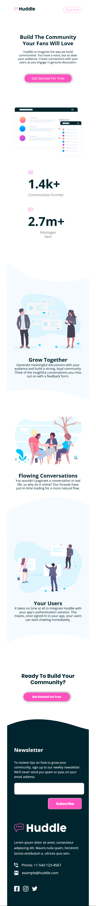

# Frontend Mentor - Huddle landing page with curved sections solution

This is a solution to the [Huddle landing page with curved sections challenge on Frontend Mentor](https://www.frontendmentor.io/challenges/huddle-landing-page-with-curved-sections-5ca5ecd01e82137ec91a50f2). Frontend Mentor challenges help you improve your coding skills by building realistic projects.

## Table of contents

- [Overview](#overview)
  - [The challenge](#the-challenge)
  - [Screenshot](#screenshot)
  - [Links](#links)
- [My process](#my-process)
  - [Built with](#built-with)
  - [What I learned](#what-i-learned)
  - [Continued development](#continued-development)
  - [Useful resources](#useful-resources)

## Overview

### The challenge

Users should be able to:

- View the optimal layout for the site depending on their device's screen size
- See hover states for all interactive elements on the page

### Links

- Solution URL: [My Solution]()
- Live Site URL: [Live Preview](https://mosnad-web01.github.io/Jalal-huddle-landing-page-with-curved-sections-master-main/)

### Screenshot




## My process

### Built with

- Semantic HTML5 markup
- CSS custom properties
- Flexbox
- CSS Grid
- Mobile-first workflow

### What I learned

In this project I have implemented the box-shadow and styling of the input tag, also learned how we can show some text onhover/onFocus/onActive.

Used properties like display:none and color: transparent

See below code snippet:

```html
<div class="subscriber-email flex-item">
  <div class="email-input">
    <input type="email" name="email" id="email" placeholder="john#mail.com" />
    <div class="error-text">Check your email please</div>
  </div>
</div>
```

```css
::placeholder {
  color: transparent;
}

:is(:hover, :focus, :active)::placeholder {
  /* Chrome/Opera/Safari */
  color: #999;
}

.error-text {
  margin-top: 0.5rem;
  font-size: 0.825rem;
  color: var(--clr-light-red);
  display: none;
}

input[type="email"]:is(:hover, :focus, :active) + .error-text {
  display: block;
}

input[type="email"]:is(:hover, :focus, :active) {
  cursor: pointer;
  border: 1px solid red;
}
```
